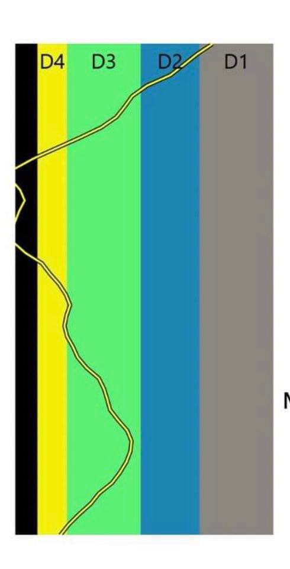
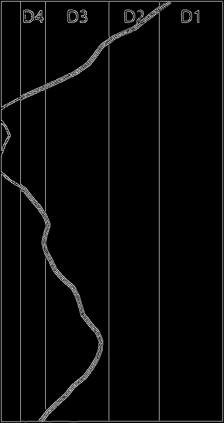
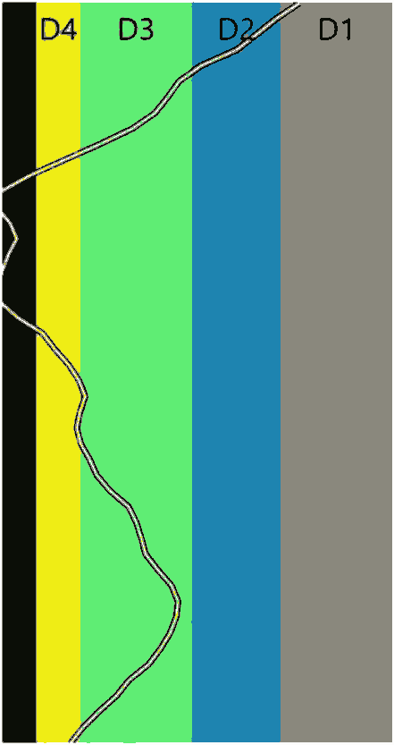
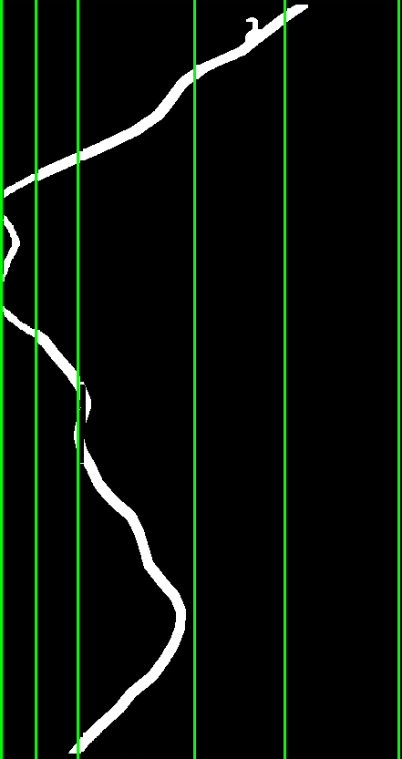

# Implanting
Color Percentage Calculator for Implant Planning 


1. Input Image



2. Binarized Image



3. Color Quantized Image



4. Curve line with seps




Output:
```
[1, 39, 85, 213, 312, 437]  # seps
# percentages
10.406120676756201
13.690183782912198
60.07861281786573
13.066289339716553
2.39056482209631
```
